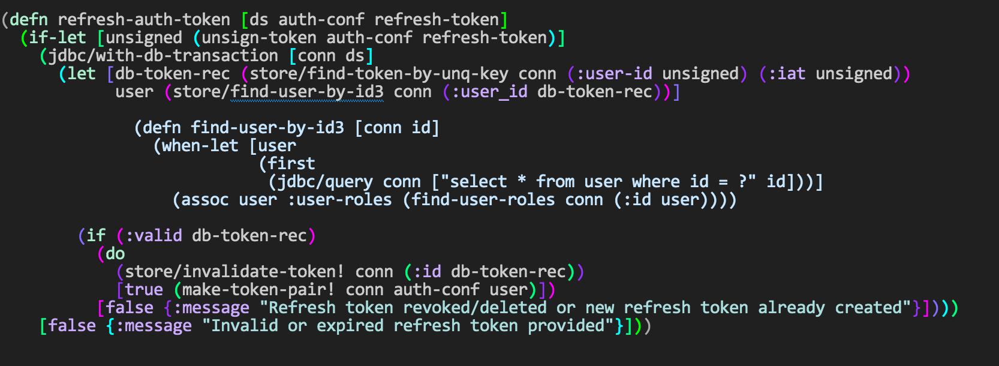
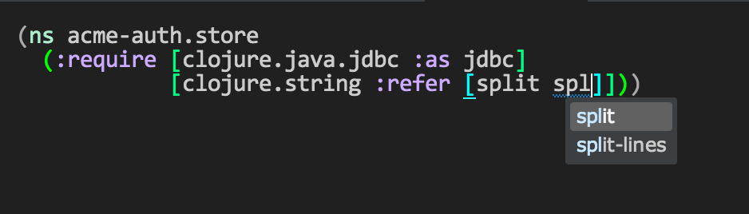
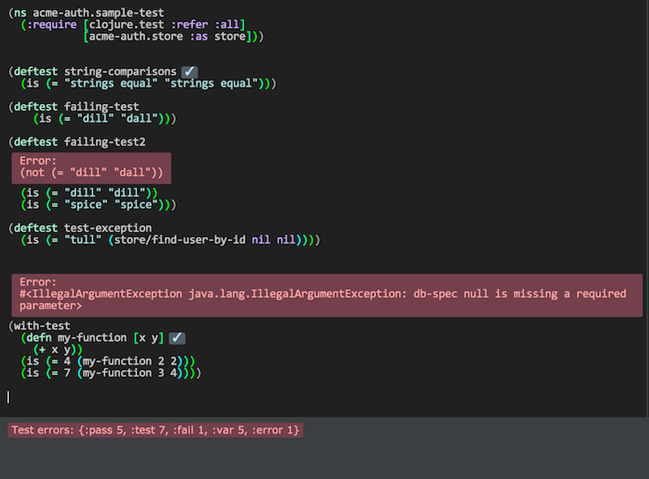
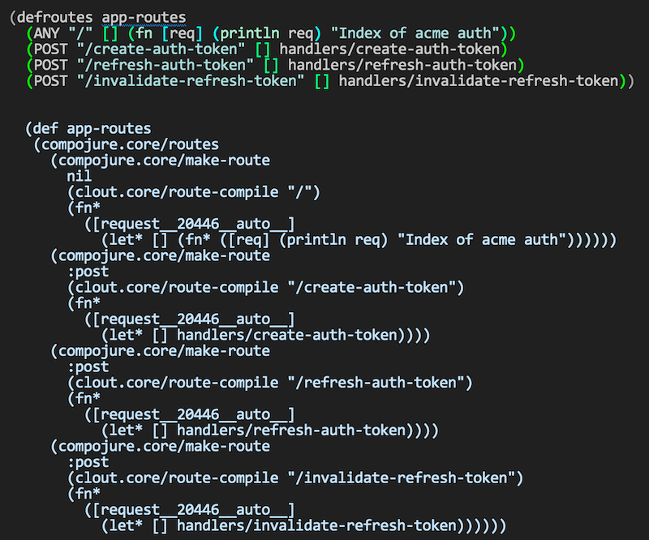

= Clj-Light-Refactor
Plugin that provides Clojure refactoring support in Light Table
v0.1.0, 2015-04-09: Initial release
:library: Asciidoctor
:numbered:
:idprefix:
:toc: macro

toc::[]

== Introduction
Refactoring support in your editor might make you lazy, your typing skills might deteriorate as well. But still if it makes
you more productive and/or lets you spend more focus at the task at hand maybe its worth it.

The goal of this plugin is provide Clojure (and to some extent ClojureScript) refactoring support in Light Table.
Some of the features requires the manual installation of middleware.

== Installation

=== Plugin manager
You will find the plugin through the Light Table plugin manager under the name clj-light-refactor

=== Development
If you want try it out the lastest stuff you can clone it to the plugins
folder for LightTable (check the https://github.com/LightTable/LightTable/wiki/User-Intro#user-settings[LT docs] for  where)

WARNING: However you are on your own, you should know what you are doing! Also you might have to compile the plugin and/or reload it's behaviors.

== Resources
* http://rundis.github.io/blog/2015/clj_light_refactor.html[Clojure Refactoring in Light Table] - Blogcast showcasing some of the features coming to a plugin manager near you

== General preconditions
* The LightTable Clojure plugin (bundles with Light Table so a no-op)
* The LightTable Paredit plugin (__TODO: Hoping to get rid of this as a dependency__)
* You need the refactor-nrepl middleware setup (see below)

== Limitations
* Profiles are not handled particularily well (ie might throw exceptions, or some operation results in a noop when they shouldn't)
* Some refactorings currently uses **cljs.reader/read-string** to "parse" code. That reader only
supports a subset of clojure's syntax (no-ops and/or exceptions may happen when using reader macros like ', #, @ etc)

== PAREDIT
The plugin comes bundled with wastly improved PAREDIT support. See link:PAREDIT.adoc[] for details.

== Middleware independent refactorings

=== Introduce ns
Command: **Clojure refactor: Introduce ns**

Adds toplevel namespace definition. Deduces ns from filename of editor and source-paths in project.clj.
Finds project.clj either by explicit connection or searching up for a project.clj file.

WARNING: If you have overridden source-paths in a profile definition in your project.clj. This feature will not
pick up that (currently)

=== Threading
These refactorings work without the nRepl middleware, and should work both for clojure and clojurescript
editors.

[cols="2*", options="header"]
|===
|Command
|Description

|Thread fully
|Converts a nested expression to a threaded one (_given that you have provided a recognized threading operator_)

|Unwind fully
|Unwinds a threaded exception (including the threading macro)

|Thread one
|Threads a nested expression one level down.

|Unwind one
|Unwinds a threaded expression one level up

|Thread first fully
|Like thread fully. You don't need to provide the threading operator as a wrapped form before invoking, the form is automatically wrapped with a thread-first macro

|Thread last fully
|Like thread first fully, but with the thread-last macro

|===

[source, clojure]
----
;; place the cursor to the left of the outer form (or on/left of the threading symbol) and invoke Thread fully
(-> (assoc (assoc {:a 1} :b 2) :c 3))
;; You'll get
(-> {:a 1} (assoc :b 2) (assoc :c 3))

;; If only one arg (i.e function) parens are removed, so thread first fully on the following:
(:c (:b (:a {:a {:b {:c 1}}})))
; yields
(-> {:a {:b {:c 1}}} :a :b :c)

----

=== Cycle if
Command : **Clojure refactor: Cycle if**

Allows you to cycle between if/if-not. Works for both Clojure and ClojureScript.

.Usage
* Position cursor inside an if/if-not form (typically either after start parens or before end parens)
* Execute the command
* If changed to if-not and vice-versa, and true/false parts are swapped accordingly

=== Cycle col
Command : **Clojure refactor: Cycle col**

Allows you to cycle between collection types. Works for both Clojure and ClojureScript.

.Usage
* Position cursor inside an collection boundary (typically either after start token or before end token)
* Execute the command
* Collection will be cycled as follows
** List -> Vector
** Vector -> Map
** Map -> Set
** Set -> List

== Clojure addons

=== Show definition
Shows definition for a symbol inline. Handy when you just want to have a quick peak
at the definiton of symbol without leaving the context of the editor (and position) you are currently are in.
Think of it like an extended version of the existing LT inline doc function.
Works for both Clojure and ClojureScript.

.Usage
* Position cursor at symbol (typically a function call or referenced var)
* Select command **Clojure refactor: Show definition**
* If found the function/var is displayed inline

== Middleware dependent refactorings

The following refactorings requires you to use additional middeleware. This enables more
extensive refactoring support, but the flipside is manual setup and increased connection times for your projects.

=== Preconditions
Add the following, either in your project's __project.clj__, or in the :user profile found at __~/.lein/profiles.clj__:
[source,clojure]
----
:plugins [[refactor-nrepl "1.0.4-SNAPSHOT"]
          [cider/cider-nrepl "0.9.0-SNAPSHOT"]]
----

=== Dependency autocompletion
Autocomplete functionality for filling in dependency vectors in your _project.clj_ files.

.Usage: (To be improved!)
* Open project.clj file
* Ensure it's tied to a project connection (Do an eval (cmd/ctrl +l) or invoke the command **Clojure refactor: Ensure editor connected**)
* When you start typing (might lag a little the first time), the autocompleter will suggest from all available clojars artifacts
* When you select an item from the autocompleter one of two things happens:
** If the selected artifact has only one version, the version indentifier is filled in
** If the artifact has multiple versions, a select with version (sorted) is shown for selection

NOTE: This feature has quite a few rough edges, so consider it a incubating idea more than anything else

=== Hotload dependency
Feature to allow hotloading of a new dependeny in your current repl session.

.Usage
* Open project.clj file
* Add a dependency in the __:dependency__ vector
* With the cursor inside the vector for your dep select the command **Refactor: Hotload dependency**
* Any errors are displayed inline

NOTE: The feature only clojars artifacts. Be aware there is no unload feature !

=== Find usages
Finds occurrences of symbols like defs and defns both where they are defined (if available) and where they are used.

.Usage:
* Move your cursor to an applicable symbol
* Invoke the command: **Clojure refactor: Find usages**
* If the editor isn't connected to a project, it will try to do so using Light Table std connect feature.
* Search results are shown in a separate tab for "Find usages" (You can move this tab to a separate tabset, it will be reused for all find usages searches)
* To move up/down the result list use the commands **Clojure refactor: Find usages - move next**/**Clojure refactor: Find usages - move previous**
* To open the selected result item **Clojure refactor: Find usages - open selected** or click on the item

NOTE: If there wasn't a connection for your project in the light table connect bar, you might have to reinvoke the command

=== Rename symbol (Incubating)
Application of find usages that renames a symbol

.Usage:
* Move your cursor to an applicable symbol
* Invoke the command: **Clojure refactor: Rename symbol**
* You are prompted to enter a new name
* Enter new name and press enter
* If the editor isn't connected to a project, it will try to do so using Light Table std connect feature.
* If all goes well the symbol is renamed :)

WARNING: This feature is currently somewhat incomplete. After a rename it doesn't currently reload
namespaces as necessary. (Eval'ing the newly renamed symbol should get you back on track though)

TIP: The above becomes a lot more managable should you adopt the https://github.com/stuartsierra/reloaded[reloaded] workflow.

=== Cleanup ns
Will clean up your namespace definition (removing unused, sort etc). See https://github.com/clojure-emacs/refactor-nrepl#clean-ns[here] for details

.Usage:
* When in an editor invoke the command **Clojure refactor: Cleanup ns**
* If any cleanup was necessary, your namespace declaration was updated

NOTE: The command works on the file, so you need to make sure you saved any changes to the namespace declaration
before you invoke it. If replacement was performed, the changes are not automatically saved.

=== Resolve missing
Tries to resolve the symbol at point and require or import the missing var.

.Usage:
* When in an editor place the cursor at a symbol and invoke the command **Clojure refactor: Resolve missing**
* If only one result, it is added to the ns declaration, if more than one suggestion is available you
are prompted to select one
* When added the ns form is also reformatted

TIP: Also works for records and types. You can undo the effect of this command using cmd/ctrl+z. This command
doesn't attempt to clean-up or be intelligent about duplicates etc. Thats handled by **Cleanup ns**

.Example - require:
[source,clojure]
----
;; With focus on this token, If you invoke the command with clojure.java.jdbc in your classpath
sql/query

;; The following is added to your namespace :require form
[clojure.java.jdbc :as sql]
----

.Example - import:
[source,clojure]
----
;; With focus on this token, If you invoke the command with clojure.java.jdbc in your classpath
LinkedList

;; The following is added to your namespace :import form
(java.util.LinkedList)
----

=== Extract function
Extract a form in a function to a new function form (defn).

.Usage
* Position cursor somewhere at the correct level for the form you wish to extract (typically right next to start parens)
* Invoke the command **Clojure refactor: Extract function**
* The extracted function is added above the current function and extraction at point is replaced with a function invocation
* A default name of foo is added and selected with the multiple cursor feature in LT
* Change the name and "esc" to quit multiple cursor mode

If the file you are doing refactoring in is in a bad state, and exception is shown inline.

== Bonus
With the https://github.com/clojure-emacs/cider-nrepl[cider-nrepl] dependency a couple of
pretty neat features can be exposed. Some of the features have little/nothing to do with refactoring.
Rather than rolling separate plugins or submitting pull requests to the LT Clojure plugin, I'm adding
them here for convenience for the time beeing.

=== A better autocomplete ?
The current LT autocompleter for Clojure uses https://github.com/ninjudd/clojure-complete[clojure-complete].
It's pretty old and not under active development. There is an https://github.com/LightTable/Clojure/issues/25[issue]
in the Clojure plugin to improve autocompletion. One of the suggestions is to use https://github.com/alexander-yakushev/compliment[compliment].
Well cider-nrepl provides support for autocompletion using compliment, so I decided to add a proof of concept
implementation to this plugin. Hopefully to migrate to the Clojure plugin soon after LT 0.8 is released.

.Usage
* The autocompleter only kicks in when the editor is connected to a nrepl, evaluate the editor (or any form) or
use the command **Clojure refactor: Ensure editor connected**
* You should now get completion suggestions similar to what's described by https://github.com/alexander-yakushev/compliment/wiki/Examples[compliment examples]
, but with the std. LT completer (and without the docs part)

It only works for clojure (not ClojureScript currently).

WARNING: I'm having a really hard time getting to grips with the inner workings of the autocompleter plugin in
LT. So there will be cases it behaves weirdly (: It's not optimized for performance either.
Textual autocompletion is turned of and so is the default autocompleter (for clojure) that ships with LT.

.To turn it off (and optionally turn on text hints) just edit your __User behaviors__
[source,clojure]
----
 [:editor.clj :lt.plugins.clojure/use-local-hints] ; Turn on clojure plugin hints again
 [:editor.clj :lt.plugins.auto-complete/textual-hints] ; Enable textual hings again
 [:editor.clj :-lt.plugins.cljrefactor.completer/use-local-hints] ; Turn off clj-refactor autocompletion
----

=== Namespace browser
Allow you to browse your projects namespaces and public symbols. The feature depends on CIDER middleware.

.Usage
* With focus in a clojure editor for you project, invoke the command **Clojure refactor: Show ns browser**
* Filter ns by typing (starting with or cta for for example clojure.tools.analyzer)
* Use up/down arrows to change selection
* WHen you press enter for a selected ns, a list of symbols for that ns is shown
* Filter, move and if you find the symbol you were looking for select it
* You will jump to that symbol
* Pressing esc when in a symbol list will take you back to the ns-list, esc on the ns list closes the sidebar

WARNING: With the current version of the cider-nrepl dep you might find that namespaces for you project
aren't initially shown. If you are using the http://thinkrelevance.com/blog/2013/06/04/clojure-workflow-reloaded[reloaded] workflow
that's just a matter of doing a refresh. If not, try invoking find usages which should load all your ns's.

It's also worth mentioning, that you really shouldn't be switching to a non clojure editor (or a clojure editor not in your project),
whilst having the ns-browser open and then try to select a ns. It will croak. It uses the currently active editor for code eval.

==== Exclusions
You can exclude namespaces from being shown in namespace browser by configuring the ns browser.
In your user-behaviors configure exclusion by customizing this behavior:

[source,clojure]
----
  ;; Exclusions are specified as a vector of regex'es.
  ;;Please note that you need to double-escape because I use re-pattern on the reg-ex strings
  [:clojure.nsbrowser :lt.plugins.cljrefactor.nsbrowser/set-nsbrowser-filters
    ["^cider\\.|^deps\\.|^refactor-nrepl\\.|^ibdknox\\.|^lighttable\\.nrepl"]]
----

=== Test support
With the cider-nrepl middleware you can now run clojure tests from within Light Table.

.Usage
* Open a namespace containing clojure tests
* Eval the file
* Run all tests with the command : **Clojure refactor: Test all in ns**
* Results are displayed inline and a summary is shown in the status bar
* To run a single test position the cursor in/right next to the test form and invokde **Clojure refactor: Test one at point**

NOTE: Currently you will need to manually eval any changes you make to a test before rerunning the tests. Otherwise
the test runner won't pick up your changes. Also note that there is no automatic recognition of tests or test namespaces currently.

=== Better formatting
Cider-nrepl supports https://github.com/weavejester/cljfmt[cljfmt]. This provides a much more powerful
formatting of Clojure code.

.Usage
* With the cursor inside a form
* Invoke the command **Clojure refactor: Format code**
* The top-level form is reformatted and cursor positioned at the beginning of the form
* If you make an explicit selection, only that code will be formatted

NOTE: **Requires cider-nrepl 0.9.0-SNAPSHOT or higher**.

=== Macroexpand
Ever wanted to know what that macro ends up becoming in terms of code ? Well now you can easily do that
inline from Light Table.

.Usage
* With the cursor inside a form
* Invoke the command **Clojure refactor: Macroexpand**
* The top level form is selected and the macroexansion of that is shown inline below the form
* Additional:
** If you make an expliit selection only that will be exapanded
** To expand all the way use the command **Clojure refactor: Macroexpand all**

=== Jump to resource
How about navigating directly to a resource file from a clojure file that refers to it ? Cider-nrepl to the rescue.

.Usage
* Position cursor inside the resource reference and invoke the command **Clojure refactor: Jump to resource**
* If it finds the resource with the given path on the classpath the file is opened

== Credits
* https://github.com/clojure-emacs/refactor-nrepl[refactor-nrepl] - nREPL middleware to support refactorings in an editor agnostic way.
* https://github.com/clojure-emacs/cider-nrepl[cider-nrepl] - A collection of nREPL middleware designed to enhance https://github.com/clojure-emacs/cider[CiDER].

== Contributing
Pull requests are most welcome. Please do not include the transpiled files (*_compiled*) in the PR.

== History
* Upcoming release
** Paredit features
** Improved handling of formatting for threading refactoring
* 0.1.5
** New feature: Jump to resource
** New feature: Namespace browser with jump to symbol support
** Improvement: Cleaner invocation of middleware ops
* 0.1.4
** Improvement: Better formatting when using if and threading refactoring
** Bug: Fixed bugs in if refactoring
* 0.1.3 Bugfixes:
** Rename symbol bypasses history check now
** Changed from .contains to .indexOf for strings as atom-shell branch of LT wasn't to fond of .contains
* 0.1.2 Bugfix: Forgot to update versions everywhere (:
* 0.1.1 Bugfix: Missing paredit functions not released in Paredit 0.0.4
* 0.1.0 Getting the ball rolling

== License
MIT, same as Light Table. See LICENSE.md for details.
